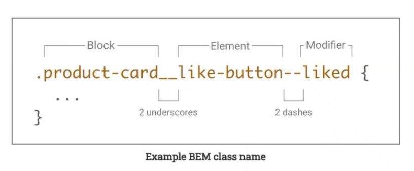
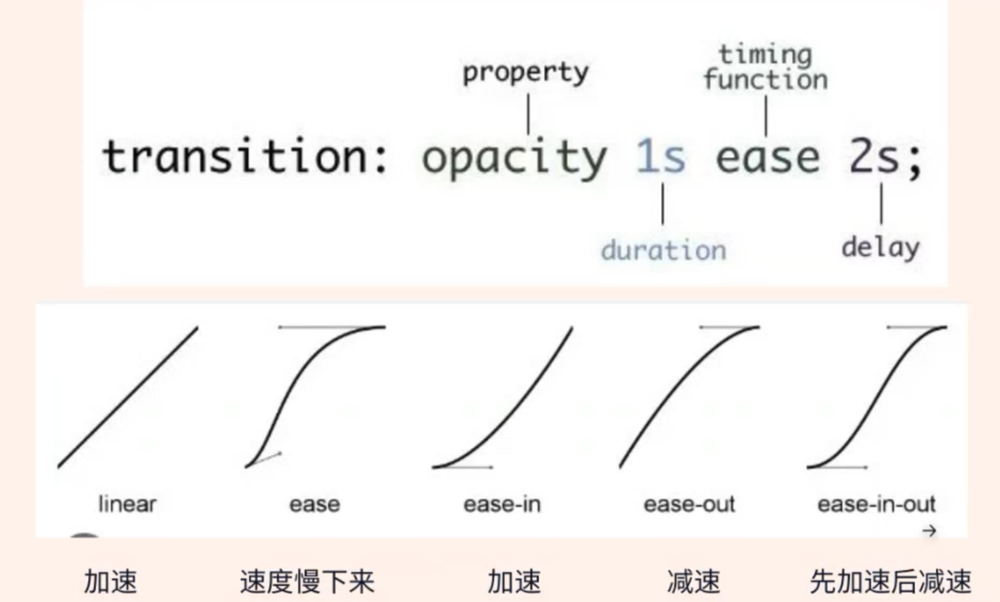

# Lecture04 CSS & Sass

本篇笔记以 Ally 老师的 Lecture 04 CSS & Sass 为框架，根据 W3School 和 MDN 进行补充，旨在辅以 22 期全栈视频，帮助同学建立起基本的学习框架。

欲了解更多实际操作和详细内容，请参考文档。

## 目录

1. [1. CSS](#1-css)
   - [1.1 CSS 中的长度单位](#11-css中的长度单位)
   - [1.2 Naming Convention in CSS](#12-naming-convention-in-css)
   - [1.3 用 Media Query 做响应式布局](#13-用-media-query-做响应式布局)
   - [1.4 Position](#14-position)
   - [1.5 Transition](#15-transition)
   - [1.6 z-index](#16-z-index)
   - [1.7 Grid](#17-grid)
2. [Sass](#2-sass)
   - [2.1 Sass Introduction](#21-sass-introduction)
   - [2.2 Sass Variables](#22-sass-variables)
   - [2.3 Nesting](#23-nesting)
   - [2.4 Mixin and Include](#24-mixin-and-include)
   - [2.5 Extend and Inheritance](#25-extend-and-inheritance)
   - [2.6 Import and Partials](#26-import-and-partials)
   - [2.7 Function](#27-function)

## 1. CSS

### 1.1. CSS 中的长度单位

`rem`, `em`, `px`, `vh`, `vw`, `%`

- `em` 是相对于**父元素**的单位，用于设置元素的尺寸，例如 width、height、padding、margin。当应用于 font-size 时，em 是相对于该元素的父元素的 font-size。
- `rem` (用的最多)是一种广泛使用的相对单位，它始终相对于**根元素**（html）的 font-size。因此，rem 在整个文档中保持一致。
- `px` 通常用于设置边框（border）等较小的尺寸，或者在特定情况下用于定位元素。
- `vh` 和 `vw` 分别表示视窗的高度和宽度的百分比单位。
- `%` 百分比单位是相对于**父元素**的，可以用于设置宽度、高度等属性，使其相对于父元素的相应属性的百分比。

### 1.2 Naming Convention in CSS

BEM (块 block、元素 element、修饰符 modifier)：

- BEM 是一种命名约定，用于创建清晰且模块化的 CSS。
- 命名模式为块\_\_元素--修饰符。
- `-` 中划线：仅作为连字符使用，表示某个块或者某个子元素的多单词之间的连接记号。
- `__` 双下划线：双下划线用来连接块和块的子元素。
- `_` 单下划线：单下划线用来描述一个块或者块子元素的一种状态。

  > 在 vue, react 中，在较小的组件中可以不用。对于公共的，全局的模块，还是推荐使用 bem

  例如：
  

  > BEM 只是所有命名方式其中一种流行命名方式  
  > 工作中也有其他命名方式，具体看公司规定  
  > 比如说在 styled-components 中 (一个用于构建 React 应用的流行的 CSS-in-JS 库)
  > 会使用驼峰命名法。

### 1.3 用 Media Query 做响应式布局

在实现响应式布局时，@media 查询是一种有用的 CSS 功能，允许根据设备的屏幕宽度或其他特征应用不同的样式。以适应手机，平板和 pc。

```css
body {
  background-color: green;
}

/* 在最大宽度为 1200px 以下时应用的样式 */
@media screen and (max-width: 1200px) {
  body {
    background-color: purple;
  }
}

/* 在最大宽度为 600px 以下时应用的样式 */
@media screen and (max-width: 600px) {
  body {
    background-color: yellow;
  }
}
```

- `screen` 表示这些样式只在屏幕设备上应用，而不是打印机或其他媒体类型。除了 `screen` 还有一下常用的 media 类型，作为参考：
  - `all`: 适用于所有媒体设备。
  - `print`: 适用于打印机和打印预览。
  - `speech`: 适用于屏幕阅读器等语音合成器。
  - `projection`: 适用于投影机。

> 顺序的重要性： CSS 是按照代码的顺序执行的，因此在编写@media 查询时，顺序非常重要。确保更具体的查询在更一般的查询之前，这样样式表就能正确地覆盖。后面的@media 范围不应该包含前面的范围，不然后面的样式会被覆盖。

### 1.4 Position

`position` 属性用于控制元素的定位方式：

- `static`： 默认值，元素按照标准流布局展示，即元素出现在文档流中的位置。
- `relative`： 相对于元素在标准流中的位置进行移动，但原来的标准流位置仍然占用。其特点为：

  1. 参照自己原来的位置来移动。
  2. 原来在标准留的位置继续占有，后面的盒子不会占有它原来的位置。

  ```css
  div {
    width: 100px;
    height: 100px;
    position: relative; /*开启相对定位*/
    top: 100px;
    left: 100px;
  }
  /*上述例子表示元素向下和向右移动了100px。*/
  ```

  属性：用于在相对定位的元素中进行位置微调，使元素相对于其在标准文档流中的位置进行移动。

  - `top: 100px;` 向下移动 100px
  - `top: -100px;` 向上移动 100px
  - `right: 100px;` 向左移动 100px
  - `right: -100px;` 向右移动 100px
  - `bottom: 100px;` 向上移动 100px
  - `bottom: -100px;` 向下移动 100px
  - `left: 100px;` 向右移动 100px
  - `left: -100px;` 向左移动 100px

- `absolute`：
  - 相对于最近的已定位（非 static 定位）祖先元素（absolute 并不是相对自己定位），如果没有已定位的祖先元素，则相对于文档根元素（root element）进行定位。
  - `absolute` 不会占有原先的位置。
    > 至少设置 left、top、right、bottom 中的一个，否则 absolute 不会生效。
- `fixed`： 相对于浏览器窗口进行定位，不占用原来的位置。常用于创建悬浮窗。

  ```css
  position: fixed;
  top: 0;
  left: 0;
  /*上述例子表示元素在向下滚动时，在距离父容器顶部20px的位置固定。*/
  ```

- `sticky`

  当元素在视口中满足给定的偏移位置——然后它“粘”在视口中。

  ```css
  position: sticky;
  top: 20px;
  /*上述例子表示元素在向下滚动时，在距离父容器顶部20px的位置固定。*/
  ```

  > 必须设置 top left right bottom 的其中一个， sticky 才生效。

  `fixed` _vs._ `sticky`

  > fixed 用于完全固定元素的位置，而 sticky 则用于在滚动到一定位置后固定元素的位置，但它们的使用场景有所重叠。

### 1.5 Transition:

在 CSS 中，transition 是一种用来控制属性值在一定时间范围内平滑过渡的属性。它允许你在元素属性值发生变化时，使变化过程变得更加平滑和渐进，而不是突然改变。

语法：

```css
selector {
  transition: property duration timing-function delay;
}
```

Example

```css
.box {
  background-color: blue;
  transition: background-color 0.5s ease;
}

.box:hover {
  background-color: red;
}
```

- property：要过渡的 CSS 属性的名称，比如 `color`、`opacity`、`transform` 等。
- duration：过渡的持续时间，可以是秒(s)或毫秒(ms)。例如，1s 表示过渡时长为 1 秒。
- timing-function：过渡效果的时间函数，控制过渡过程中属性值的变化速度。常见的有 ease、linear、ease-in、ease-out 等。
- delay：延迟开始过渡的时间，同样可以是秒(s)或毫秒(ms)。

transition: 除了使用伪类，也可以通过使用 js 添加和删除 class 来控制 transition 何时生效

### 1.6 z-index

z-index 是一个 CSS 属性，用于控制页面上元素的堆叠顺序（叠放顺序）。在 HTML 文档中，元素可以通过 z-index 属性来确定它们在堆叠上下文中的顺序，即哪个元素位于哪个元素的上方或下方。

注意事项：

- 只对定位元素有效： z-index 只对设置了定位属性（position 值为 relative、absolute 或 fixed）的元素有效。这是因为只有定位元素才会创建堆叠上下文。
- 同一堆叠上下文中比较： z-index 只有在同一堆叠上下文（stacking context）中才有意义。如果两个元素不在同一堆叠上下文中，它们的 z-index 值比较没有意义。
- 父子关系： 子元素的 z-index 值不会影响到父元素或其他同级元素的堆叠顺序。子元素的堆叠顺序是相对于父元素而言的。
- 层叠上下文： 某些属性和元素会触发新的层叠上下文，影响 z-index 的表现。例如，设置 transform、opacity、filter、will-change 等属性，或者使用一些 CSS 属性（如 flex、grid 等）的容器都可能创建新的层叠上下文。
- 工作中，如果一个 z-index 优先级最高，最大常设 999

### 1.7 Grid

css grid 很强大  
工作中 flex 用的比 grid 多

flex 是一维布局  
grid 是二维布局

- 容器和项目

  ```html
  <body>
    <div class="wrapper">
      <div class="one item">One</div>
      <div class="two item">Two</div>
      <div class="three item">Three</div>
      <div class="four item">Four</div>
      <div class="five item">Five</div>
      <div class="six item">Six</div>
    </div>
  </body>
  ```

  - 对一个容器开启 grid 布局使用：`display: grid;`

- 行和列

  - 容器里分为 row （行、水平） 和 column （列、垂直）
  - 使用 `grid-template-columns` 属性 `grid-template-rows` 来定义行、列宽
    Example

    ```css
    .wrapper {
      display: grid;
      grid-template-columns: 100px 100px 100px;
      grid-template-rows: 100px 100px 100px;
    }
    ```

    - repeat() 函数用于重复网格行或列的模式。它接受两个参数：重复的次数和模板，如`grid-template-columns: repeat(3, 1fr);`
    - 属性值`auto-fill`，可以与 repeat() 结合使用，使网格容器自动填充网格项，以适应容器的宽度。这在响应式设计中非常有用。
    - 属性值 `fr`, 用于指定网格容器中剩余空间的等份分配。例如：`grid-template-columns: 1fr 2fr 1fr;`
    - 属性值`minmax()`，定义网格项的最小和最大尺寸。

    Exapmle

    ```css
    grid-template-columns: repeat(auto-fill, 200px);
    grid-template-columns: 200px 1fr 2fr;
    grid-template-columns: 1fr 1fr minmax(300px, 2fr);

    grid-gap: 20px;
    grid-row-gap: 20px;
    grid-column-gap: 20px;

    grid-template-rows: 100px 200px; /*行高*/
    ```

  - 使用属性：`grid-row-gap` ，`grid-column-gap`，`grid-gap` 设置 gap
  - 了解 `justify-items`、`align-items`、`justify-self`、`align-self` 等属性，它们可以用于控制网格容器和网格项的对齐方式。

一些 flex 的属性也可以用于 CSS Grid，如 justify-content

## 2. Sass

### 2.1 Sass Introduction

Sass 是一个 CSS 预处理器。
其他预处理语言 less, SCSS(Sass 和 SCSS 都是同一项目的两种语法变体，)

为什么使用 Sass:

- 可以减少 CSS 的重复书写，从而节省时间。
- 提供简单的逻辑计算方程
- 开启了模块化的可能性

HTML 无法处理 Scss，所以只在开发阶段使用，并使用 VS code 插件或包将 Scss 文件编译成 CSS 文件

> 推荐使用的插件: **`Live Sass Compoiler`**

Sass 的 5 个特性：

1. Variables
2. Nesting
3. Minxin
4. Partials
5. Extent/Inheritance

### 2.2 Sass Variables

设置变量以复用和方便修改
Syntax:

```SCSS
$myFont: Helvetica, sans-serif;
$myColor: red;
$myFontSize: 18px;
$myWidth: 680px;

p {
    color: $myColor;
    font-size: $myFontSize;
}
```

**作用域**: Sass 变量仅在定义它们的嵌套级别可用。

### 2.3 Nesting

Sass lets you nest CSS selectors in the same way as HTML.

Example
将以下 CSS 代码改写为 Sass

```css
nav ul {
  margin: 0;
  padding: 0;
  list-style: none;
}
nav li {
  display: inline-block;
}
nav a {
  display: block;
  padding: 6px 12px;
  text-decoration: none;
}
```

改写的 Sass 代码

```scss
nav {
  ul {
    margin: 0;
    padding: 0;
    list-style: none;
  }
  li {
    display: inline-block;
  }
  a {
    display: block;
    padding: 6px 12px;
    text-decoration: none;
  }
}
```

### 2.4 Mixin and Include

使用 @mixin 指令，可以创建可复用代码（块）。  
使用 @include 指令插入已创建的可复用代码（块）。

Syntax:

```scss
@mixin customised-mixin-name {
  property: value;
  property: value;
}

div {
  @include customised-mixin-name;
}
```

Example:

```scss
@mixin style($size: 15px, $color: #999) {
  font-size: $size;
  color: $color;
  line-height: 1.5;
}

div {
  @include style(25px, black);
}
```

> 上述例子中，通过传参的方式，重新定义了字体大小与颜色

### 2.5 Extend and Inheritance

选择器继承可以让选择器继承另一个选择器的所有样式。使用选择器继承，要使用`@Extend`，后面紧跟需要继承的选择器。

> 需要配合`%`占位符选择器使用

Example:

```scss
%button-style {
  background-color: blue;
  color: white;
  padding: 10px 20px;
}

.button {
  @extend %button-style;
}

.success-button {
  @extend %button-style;
  background-color: green;
}
```

在上面的例子中，%button-style 是一个占位符选择器，定义了一个按钮的样式。然后，.button 类选择器通过 `@extend %button-style;` 从 %button-style 中继承了相同的样式。同样，.success-button 类选择器也继承了相同的样式，并覆盖了背景颜色，使其成为绿色。

在生成的 CSS 中，.button 和 .success-button 将都包含来自 %button-style 的样式，避免了样式的重复定义。

### 2.6 Import and Partials

`@import`  
The `@import` directive allows you to include the content of one file in another.

```scss
@import reset;
@import colors;
```

`Partials`

- 默认情况下，Sass 直接转译所有 .scss 文件。然而，当你想要 导入文件时，不需要直接转译该文件。
- 如果你的文件名以下划线开头，Sass 将不会转译它。

### 2.7 Function

Sass 和 SCSS 中的函数（Functions）允许你在样式表中执行计算、操作数据以及生成动态的样式。Sass 的函数可以用于生成值，例如颜色、数字、字符串等。：

1. 内置函数: SCSS 内置了许多函数，用于处理颜色、数学运算、字符串等。
   Example: SCSS 内置 darken，和 round 函数
   ```scss
   $color: darken(#3498db, 10%);
   $result: round(5.7);
   ```
2. 自定义函数： 使用@function 关键字创建自定义函数。  
   Example

   ```scss
   // 定义自定义函数
   @function add-margin($value) {
     @return $value + 10px;
   }

   // 使用自定义函数
   .box {
     margin: add-margin(20px);
   }

   //margin 为 30px
   ```
