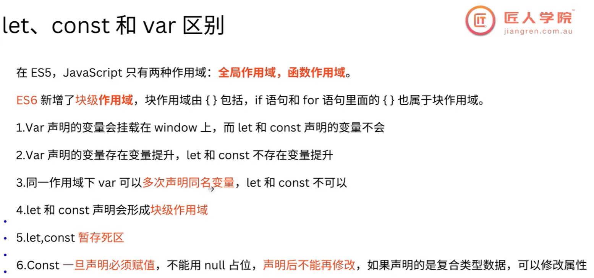
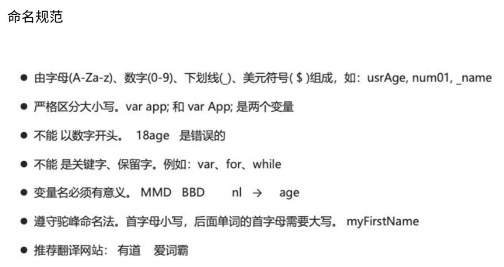
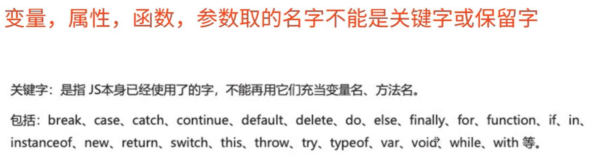
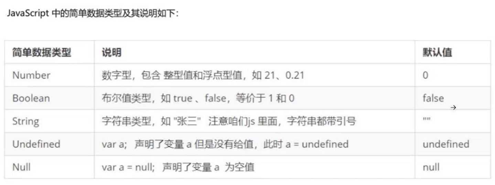
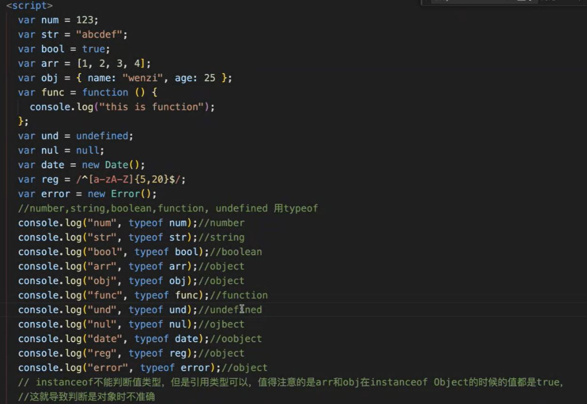
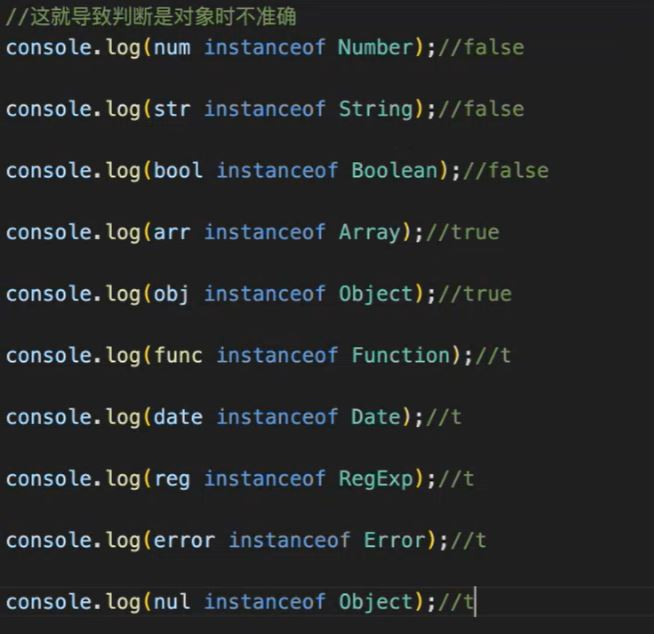
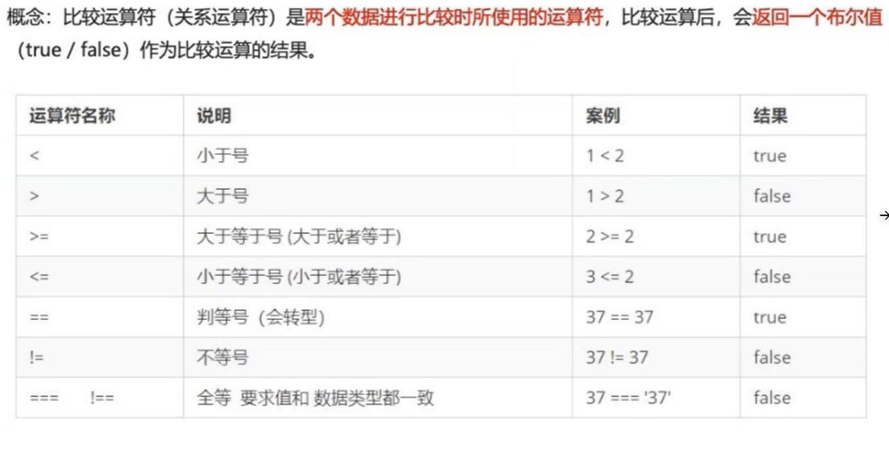
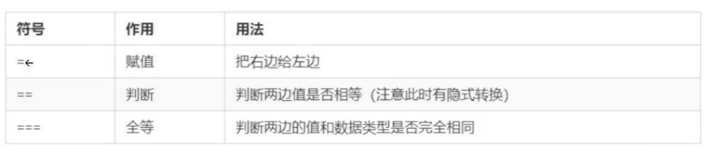
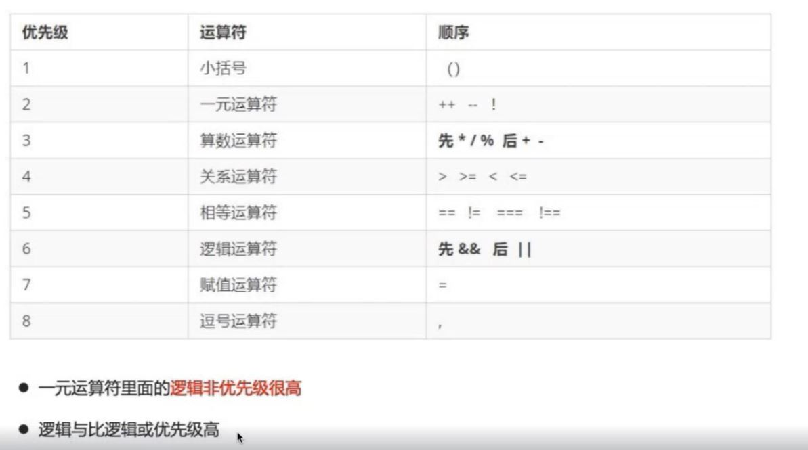

# JavaScript

## Description

本篇笔记以 Ally 老师的 Lecture 05 JavaScript 为框架，根据 W3School 和 MDN 进行补充，旨在辅助 22 期全栈视频，帮助同学建立起基本的学习框架。

## 目录

- [JavaScript Introduction](#javascript-introduction)
- [变量 variable](#变量-variable)
- [JS Data Types](#js-data-types)
- [Operators](#operators)
- [Conditional Statements](#conditional-statements)
- [Loops](#loops)
- [Arrays 的方法](#arrays的方法)
- [Functions](#functions)

## JavaScript Introduction

JS 的历史

- JavaScript 是 Brendan Eich 用十天开发完成，JavaScript 最初是为了在浏览器中提供动态交互的能力而创建的。现已成为最流行的语言之一，是 Web 的重要组成部分。

ECMAScript 标准

- 后来，ECMAScript 标准化，为 JavaScript 的进一步发展奠定了基础。重要的版本如 ES6（ECMAScript 2015）引入了许多新特性，如箭头函数、模板字符串、解构赋值等，提高了语言的表现力和开发效率。

现代 JavaScript 框架和库：

- 随着 Web 应用的复杂性增加，出现了许多 JavaScript 框架和库，如 React、Angular、Vue 等，以简化和加速 Web 开发过程。

浏览器之外的 JavaScript：

- 随着 Node.js 的出现，JavaScript 开始在服务器端应用中广泛使用。Node.js 允许 JavaScript 在服务器上运行，使其成为全栈开发语言。

单线程和异步编程

- JavaScript 是一种单线程语言，这意味着它一次只能执行一个任务。为了处理异步操作，JavaScript 使用事件循环（Event Loop）来处理回调函数、Promise、async/await 等机制，以确保非阻塞的执行方式。

- Web API 和 Web 平台的发展：
  随着 Web 平台的不断发展，浏览器提供了丰富的 Web API，允许开发者访问设备硬件、地理位置、媒体流等功能，推动了 Web 应用的创新和多样性。

脚本语言

- 不需要编译，运行过程由 JS 解释器逐行解释并运行。

JS 的作用

- 表单校验，网页特效，服务端开发(Node.js)，桌面程序(Electron), App(Cordova),物联网，游戏开发等

JS 的组成

1. ECMAScript 标准
2. DOM 页面文档对象模型
   - Browser 提供的接口，用于操作页面的
3. BOM 浏览器对象模型
   - 与浏览器进行互动

JS 代码/文件的书写位置

1. 行内 js，写在 html 命令行内。
   - 很少用，可读性差，不方便维护
   ```html
   <input type="button" onclick="alert('点击了按钮')" />
   ```
2. 内嵌 js
   ```html
   <script>
     alert("Hello, World.");
   </script>
   ```
3. 外部 js 文件
   - 导入外部 JS 文件，最佳实践：它使得 JavaScript 代码可以单独维护，可以被多个页面共享，而且浏览器可以缓存这些文件，提高页面加载速度。这也符合最佳实践，尤其在大型项目中更为重要。
   ```html
   <script src="index.js"></script>
   ```

## 变量 variable

声明与赋值

- 变量在使用前需要先声明，声明的本质是为变量分配内存空间。常用的声明变量的关键字有 let、const 和 var，它们有一些区别
   - let： 具有块级作用域，可重新赋值。 - const： 具有块级作用域，不可重新赋值，适用于常量。 - var： 具有函数作用域（没有块级作用域），存在变量提升（Hoisting），可重复声明和重新赋值，容易导致全局变量污染。

  ````js
  // 比如说在函数内 var 的变量在函数外事 not defined
  function fun() { // 函数作用域
  var num1 = 20;
  console.log('num1', num1) //-> num1 20
  }
  console.log('num1', num1) //-> Error

           if (true) {
              var a = 1;
           }
           console('a',a) //-> a,1
           //说明对于var,if没有块级作用域,在if内定义的变量a可以在if被获取到
           ```
           > ES6 之后的 let和const设置了块级作用域

  > 面试可能问 var let const 的区别
  > 平常只需要理解，面试的时候需要在理解的基础上背每一道面试题目
  > 处理 error 使用 try catch
  ````

命名规范


- 变量，属性，函数，参数 取名不能是关键字和保留字
  
- 常使用驼峰命名法

## JS Data Types

> JS 是弱类型语言

数据类型

1.  基本数据类型
    - Number, Boolean, String, Undefined, Null
      
2.  引用数据类型
    - Function, Array, Object
    - 存储的是地址，而不是 value

JS 的 Type Conversion

- 字符串 + 其他类型, 最终结果都是字符串类型
  动态的数据操作

```js
console.log("" + 12); //-> "12"
console.log("5" + 6); //-> "56"
```

- toString()
- String()
- parseInt() 可以把字符串转化为数字类型，得到的是整数
  ```js
  console.log(parseInt("3.14")); //-> 3
  console.log(parseInt("120px")); //-> 120
  console.log(parseInt("rem120px")); //-> NaN
  ```
- parseFloat() 可以把字符串转化为数字类型，得到的是小数
  ```js
  console.log(parseFloat("3.14")); //-> 3.14
  console.log(parseFloat("120px")); //-> 120
  console.log(parseFloat("rem120px")); //-> NaN
  ```
- Number()
- 利用 - \* / 将字符串转换成 Number 类型
  ```js
  console.log("12" - 0); //-> 12
  console.log("123" - "120"); //-> 3
  console.log("123" * 1); //-> 123
  ```
- Boolean()
  ```js
  console.log(Boolean("")); //-> false
  console.log(Boolean("0")); //-> false
  console.log(Boolean("NaN")); //-> false
  console.log(Boolean("null")); //-> false
  console.log(Boolean("undefined")); //-> false
  console.log(Boolean("123")); //-> true
  console.log(Boolean("hello")); //-> true
  ```

## Operators

判断数据类型

1. 使用 typeof 判断数据类型

   

2. 使用 instanceof 判断数据类型

   

3. 判断 Array
   - Array.isArray()
     ```js
     // Array.isArray(参数); H5新增的方法 ie9以上版本支持
     console.log(Array.isArray(arr)); //-> true
     console.log(Array.isArray(obj)); //-> false
     ```

算数运算符

- `+`, `-`, `*`, `/`, `%`
- 不能直接拿浮点数进行计算，会有计算误差
  - 解决办法：
    1. 先转化为整数，相加之后再转化为小数
    2. `toFixed(1);`

递增和递减运算符

- 前置递增运算符 ++a
  - 口诀：先自加，后返回值
  ```js
  let a = 1;
  console.log(++a); //-> 2
  console.log(a); //-> 2
  ```
- 后置递增运算符 a++
  - 口诀：先返回值，后自加
  ```js
  let a = 1;
  console.log(a++); //-> 1
  console.log(a); //-> 2
  ```

比较运算符




- == 和 ===
  - 两个等号很少用，工作当中基本都要求使用全等 ===

逻辑运算符

- `&&`
  - `console.log(3 > 5 && 3 > 2);`
  - 两个都为 true,才返回 true
- `||`
  - `console.log(3 > 5 || 3 > 2);`
  - 只有有一个为 true,就返回 true
- `！`
  - `console.log(!(3 > 5));`
  - 取反

运算符优先级


Spread Operator `...`

1. copy array
   ```js
   let arr = [1, 2, 3];
   let arr2 = [...arr];
   ```
2. concatenating array
   ```js
   let arr = [1, 2, 3];
   let arr2 = [4, 5, 6];
   let arr3 = [...arr, ...arr2];
   ```
3. output
   ```js
   // 工作中常用的方法
   let person = { name: "tom", age: 18 };
   let person2 = { ...person, name: "jack" };
   ```
   - 类似方法：`person2 = Object.assign({}, person, { name: jack })`

解构赋值

- 解构赋值是一种在 JavaScript 中，通过一种语法将数组或对象的值赋给变量的方法。这使得可以更简洁地提取数据并赋值给变量。
- 解构赋值的语法有两种主要形式：数组解构赋值和对象解构赋值。
- 字符串也可以使用解构赋值
- 解构赋值可以设置默认值

```js
// array
let numbers = [1, 2, 3, 4, 5];
let [a, b, ...rest] = numbers;

console.log(a); // 输出：1
console.log(b); // 输出：2
console.log(rest); // 输出：[3, 4, 5]

// object
let person = { name: "John", age: 30, city: "New York" };
let { name, age, ...rest } = person;

console.log(name); // 输出：John
console.log(age); // 输出：30
console.log(rest); // 输出：{ city: "New York" }

// string
let [a, b, ...rest] = "hello";

console.log(a); // 输出：h
console.log(b); // 输出：e
console.log(rest); // 输出：["l", "l", "o"]

// 默认值
let user = { name: "John", age: 30};
let { name, age, gender: "male"} = user;

console.log(gender); // 输出："male"
```

解构赋值的用途：

```js
// 1. 交换变量
let num1 = 1;
let num2 = 2;
[num1, num2] = [num2, num1];
console.(num1, num2); //-> 2 1

// 2. 从函数返回多个值
// 返回一个数组
function example(){
   return [1, 2, 3];
}

let [a, b, c] = example();
// 返回一个对象
function example2(){
   return {
      sum1:1,
      sum2:2
   }
}

let {a, b} = example2();
```

```js
function sum(first, ...args) {
  console.log(first); //-> 10
  console.lof(args); //-> [20, 30]
}

sum(10, 20, 30);
```

## Conditional Statements

使用 Conditional Statements 让代码做出决策

- `if else`
- `switch`
- 三元表达式
  - 表达式？表达式 1:表达式 2

## Loops

- `for` 循环
- `while` 循环
  ```js
  let sum = 0;
  let i = 1;
  while (i <= 100) {
    sum += i;
    i++;
  }
  ```
- `do...while`
  使用`break`和`continue`来调控循环的行为
  - `continue`:退出本次循环，进行下一次
  - `break`:退出整个循环

## Arrays 的方法

- `push()`
- `shift()`
- `pop()`
- `unshift() `
  - 在 array 前面追加一个新的元素，返回新数组的长度
- `indexOf`
  - 返回第一个满足条件的索引号, 找不到就返回`-1`
- `lastIndexOf`
  - 返回最后一个满足条件的索引号, 找不到就返回`-1`
- `forEach() `
  - 使用回调函数对每一个元素进行操作
- `filter()`
  - 不会改变原数组，返回一个 new array, 包括符合条件的 item
- `reduce`
  - 方法的主要作用是对数组的所有元素执行一个提供的回调函数，将数组缩减（reduce）为一个单一的值。这个方法经常用于对数组中的元素进行累积、求和、查找最大值或最小值，以及进行各种聚合操作。

遍历对象

- `for in`

  ```js
  for (变量 in 对象) {
  }
  ```

- `Object.keys(obj)`
  - 拿到一个对象里面所有的 key，并返回一个 array
  ```js
  Object.keys(obj).forEach((key) => {
    console.log(obj[key]);
  });
  ```
- `Object.keys(value)`
  - 拿到一个对象里面所有的 value，并返回一个 array
- `Object.entries()`
  - 拿到一个对象里面所有的 key:value，并返回一个 array
  ```js
  Object.entries(obj).forEach(([key, value]) => {
    console.log(value);
  });
  ```

> 对于方法，要关注原数组有没有发生变化，返回的是什么

> 有些数组方法消耗很大，工作中要尽量避免不必要的使用消耗很大的方法  
> 比如`concate`就比`push()`消耗大，只要允许改变原数组，可以选择改变原数组  
> 如果要求不能更改原数组就只能复制了

## Functions

函数的写法和区别

- function declaration
  `js
function fun(a, b){
   console.log(a, b)
}
`
- function expression
  `js
const fun = function(a, b){
   console.log(a, b)
}
`
- 箭头函数
  `js
  const fun = (a, b) => {
     console.log(a, b)
  }
  `
  > 如果少传了实参，没有传的实参是 undefined

`return`语句

- 终止函数，`return`后面的代码不会执行
- `return`只能返回一个值，如果 return 后面写了很多值，则返回最后一个。`return a, b, c; //-> c`
- 如果不写`return`，则返回`undefined`

浅拷贝（当不希望改变原数组的时候，或不嵌套的）：

- Array
  - 最简单的是 lodash 的 `_.clone`方法
  - Spread Operator
  - `Array.from(arr)`
  - `arr.slice()`
- Object
  - Spread Operator
    > 工作中经常用
  - `Object.assign() `
    > 工作中经常用
- 对于 nested 嵌套的，只拷贝了第一层，对于深层的修改，依然会对多个数组或对象有影响，这时候需要使用深拷贝

深拷贝

- `JSON.parse(JSON.stringify(object))`
- lodash 包 的 cloneDeep `_.cloneDeep`
  - 最简单
- `structuredClone()`
