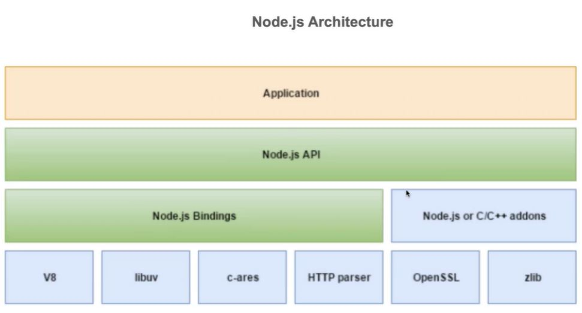

# Lecture 14 Node Part 1

本篇笔记是以 Mason 老师的 Lecture 14 Node.js (Part 1) 的课堂内容整理的随堂笔记。

参考：

- [课堂代码](https://github.com/LazeBear/jr-fullstack-notes-22)

## Table of Contents

1. [Course Structure](#1-course-structure)
2. [About Node.js](#2-about-nodejs)
   - 2.1 [Non-blocking and Asynchronous](#21-non-blocking-and-asynchronous)
   - 2.2 [Event-driven and Event Loop](#22-event-driven-and-event-loop)
3. [Node.js Architecture](#3-nodejs-architecture)
4. [Node Version](#4-node-version)
5. [Module Management](#5-module-management)
   - 5.1 [ES Module](#es-module)
   - 5.2 [CommonJS Module](#commonjs-module)
   - 5.3 [Private Variable & IIFE](#private-variable--iife)
6. [Built-in Module](#6-built-in-module)
   - 6.1 [File System - fs](#61-file-system---fs)
   - 6.2 [Http](#62-http)
7. [JSON](#7-json)

## 1. Course Structure

- Node.js basic
- API & RESTfulAPI
- NPM & Express.js
- MongoDB & Mongoose
- Authorization & Autheticaton
- Testing
- Deployment

## 2. About Node.js

- Node.js is a **JavaScript runtime environment** built on Chrome's V8 engine. (Chrome's V8 engine is a high-performance JavaScript engine.)

  > 💡 Another Runtime Environment: [Bun](https://bun.sh/)

- Node.js provides an environment for executing JavaScript code outside of a web browser. It allows developers to use JavaScript to build server-side applications, not just client-side scripts running in browsers.

- Node.js is commonly used for creating the server-side logic of **web applications and APIs**. It also capable of building **cross platform desktop applications** using Electron.

  > 💡 Framework: [Electron](https://www.electronjs.org/)

- It's suitable for building scalable and high-performance networked applications due to its **asynchronous, non-blocking nature**.

- Node.js is designed to be **non-blocking** and **asynchronous**, meaning it can handle many concurrent operations without waiting for one to complete before starting the next.

- It uses an **event-driven model**, where certain functions are executed in response to events, allowing for efficient handling of I/O (Input/Output) operations.

- Node.js uses **non-blocking I/O operations**, enabling it to handle multiple requests simultaneously.

- This is achieved through asynchronous programming, where tasks are initiated, and the system is notified when the task completes.

### 2.1 Non-blocking and Asynchronous

- Asynchronous 异步 | non-blocking 非阻塞

  - Asynchronous operation is like making a phone call, leaving a message, and continuing with your day while waiting for a callback. You don't wait on the line.

- Synchronous 同步 | blocking 阻塞

  - wait on the line

- JavaScript is single threaded, so it use **Event Loop** to enable Asynchronous operation, to make it non blocking and allowing tasks to be processed concurrently

### 2.2 Event-driven and Event Loop

> [Event-Driven Programming in JavaScript](https://medium.com/@teamtechsis/event-driven-programming-in-javascript-c47ea5975005)

> [Event Loop simulator](http://latentflip.com/loupe/?code=JC5vbignYnV0dG9uJywgJ2NsaWNrJywgZnVuY3Rpb24gb25DbGljaygpIHsKICAgIHNldFRpbWVvdXQoZnVuY3Rpb24gdGltZXIoKSB7CiAgICAgICAgY29uc29sZS5sb2coJ1lvdSBjbGlja2VkIHRoZSBidXR0b24hJyk7ICAgIAogICAgfSwgMjAwMCk7Cn0pOwoKY29uc29sZS5sb2coIkhpISIpOwoKc2V0VGltZW91dChmdW5jdGlvbiB0aW1lb3V0KCkgewogICAgY29uc29sZS5sb2coIkNsaWNrIHRoZSBidXR0b24hIik7Cn0sIDUwMDApOwoKY29uc29sZS5sb2coIldlbGNvbWUgdG8gbG91cGUuIik7!!!PGJ1dHRvbj5DbGljayBtZSE8L2J1dHRvbj4%3D)

Example:

```js
console.log('A');
setTimeout(() => {
  console.log('B');
}, 1000);
console.log('C');
// A
// C
// B
```

- How does setTimeout work?

  1. When **_setTimeout_** is called, the setTimeout function along with its parameters is pushed onto the **_call stack_**.

  2. In the browser or Node.js (Web API in browser and Node.js are different), the web API (Thread Pool) begins a countdown of 1000 milliseconds.

  3. The JavaScript engine continues to execute subsequent synchronous tasks until the call stack is empty.

  4. After 1000 milliseconds, setTimeout is placed in the **_Callback Queue （First In First Out）_**.

  5. The **_event loop_** checks if the call stack is empty reguarly. If the call stack is empty, meaning all synchronous functions have finished executing, the callback function from setTimeout is executed. Therefore, **the final waiting time for setTimeout may be longer than 1000 milliseconds**.

> 💡 setTimeout is not always accurate, and how to fix it?

> In Node.js, in addition to the Callback Queue, there is also a Promise Queue used to handle asynchronous operations based on Promises. The handling of Promises is similar to setTimeout, but the callback functions of Promises are pushed into the Promise Queue rather than the Callback Queue. The event loop first processes the **_microtask queue (such as the Promise queue)_**, and then the **_macrotask queue (such as the callback queue)_**.

> 💡 [Promise Quiz](https://github.com/LazeBear/jr-fullstack-notes-22/blob/master/1-node/promis-quiz.md)

## 3. Node.js Architecture



## 4. Node Version

- **LTS** - (**Recommonded**) the version that the Node.js Foundation considers to be highly stable, mature, and suitable for most production environments.
- **Current** - the latest stable release that includes the most recent features, improvements, and updates. This version is suitable for developers who want to experiment with new functionalities, take advantage of the latest enhancements, and contribute to the Node.js ecosystem. However, it may not be recommended for production environments due to its potentially higher degree of instability.

> 💡 Use [nvm](https://github.com/nvm-sh/nvm) (recommonded) if you are using multiple projects built with different Node version or when updating Node versions

> Check the [Node.js releases](https://nodejs.org/en/about/previous-releases)

## 5. Module Management

There is a difference between front-end development and Node.js development when it comes to module management.

- **ES Module** (Front-end)
- **CommonJS Module** (Node.js)

**ES Module**

- Uses `import` and `export` statements.
- Supports asynchronous module loading natively.

```js
// a.js
export function sum(a, b) {}

// b.js
import { sum } from './a'; // async loading / non-blocking
```

**CommonJS**

- Uses `require` to import modules and module.exports or exports to export modules.
- Synchronous module loading.

```js
// a.js
function sum(a, b) {}
module.exports = { sum }; // recommended Syntax

// Correct Syntax but not recommended: module.exports.sum = function(){}
// Correct Syntax but not recommended: exports.sum = function(){}
// Incorrect Syntax: exports = {sum};

// b.js
const { sum } = require('./a'); // sync loading / blocking
```

> 💡 Node.js used to only support CommonJS, but starting from node.js v12, it supports both. However, node.js is still recommended

**Private Variable & IIFE(Immediately invoked function expression)**

```js
const moduleA = { exports: {} };
(function (__filename, module) {
  let count = 0;

  function getCount() {
    return count;
  }

  function increaseCount() {
    count++;
  }

  module.exports = {
    increaseCount,
    getCount,
  };
})('/.../.../module.js', moduleA);

moduleA.exports.increaseCount();
console.log(moduleA.exports.getCount());
```

## 6. Built-in Module

Node.js comes with a set of built-in modules that provide a wide range of core functionalities. These modules are part of the Node.js runtime and do not require any installation.

### 6.1 File System - `fs`

Provides an API for interacting with the file system.

> [File System Docs](https://nodejs.org/docs/latest/api/fs.html)

Example:

```js
const fs = require('fs'); // import bulid-in module using module name

// Reading a file asynchronously
fs.readFile('example.txt', 'utf8', (err, data) => {
  if (err) {
    console.error(err);
    return;
  }
  console.log(data);
});

// Writing to a file asynchronously
fs.writeFile('example.txt', 'Hello, Node.js!', (err) => {
  if (err) {
    console.error(err);
    return;
  }
  console.log('File written successfully');
});
```

### 6.2 Http

- Used to create HTTP servers and make HTTP requests.

Example:

1. listen on port 3000 and return a string

   ```js
   const http = require('http');

   const server = http.createServer((req, res) => {
     if (req.url === '/') {
       res.end('hello');
       return;
     }

     res.end('hello again');
   });

   // listen on port 3000
   server.listen(3000);
   ```

2. Listen on port 3000 and return a html

   ```js
   const fs = require('fs');
   const http = require('http');
   const path = require('path');

   const server = http.createServer((req, res) => {
     if (req.url === '/') {
       fs.readFile(
         path.join(__dirname, 'home.html'),
         'utf-8',
         (error, data) => {
           if (error) throw err;

           res.end(data);
         }
       );

       return;
     }

     if (req.url === '/about') {
       fs.readFile(
         path.join(__dirname, 'about.html'),
         'utf-8',
         (error, data) => {
           if (error) throw err;

           res.end(data);
         }
       );

       return;
     }
   });

   server.listen(3000, () => {
     console.log('server running on port 3000...');
   });
   ```

> 💡 For more examples, please refer to the [GitHub code](https://github.com/LazeBear/jr-fullstack-notes-22)

## 7. JSON

**JavaScript Object Notion**

- similar with JavaScript Object, but doesn't support `undefined`

**Structure of JSON**

JSON is built on two structures:

- Objects: A collection of name/value pairs enclosed in curly braces `{}`.
- Arrays: An ordered list of values enclosed in square brackets `[]`.

Example:

```json
{
  "name": "Mason",
  "age": 18,
  "isStudent": false,
  "courses": ["Math", "Science", "Literature"],
  "address": {
    "street": "123 Main St",
    "city": "Anytown"
  }
}
```
