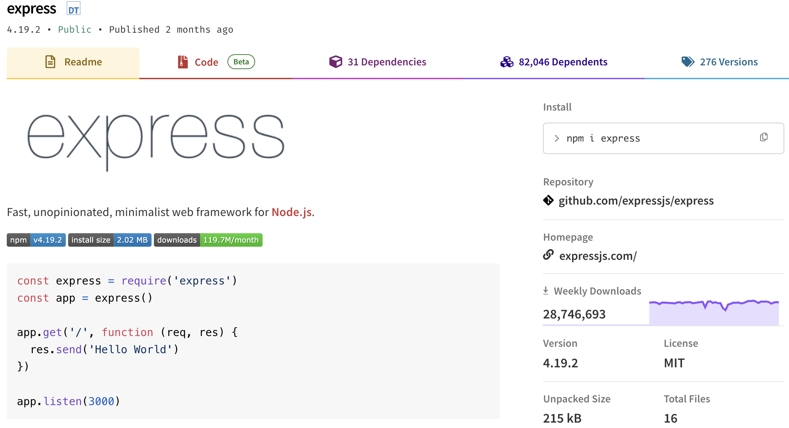
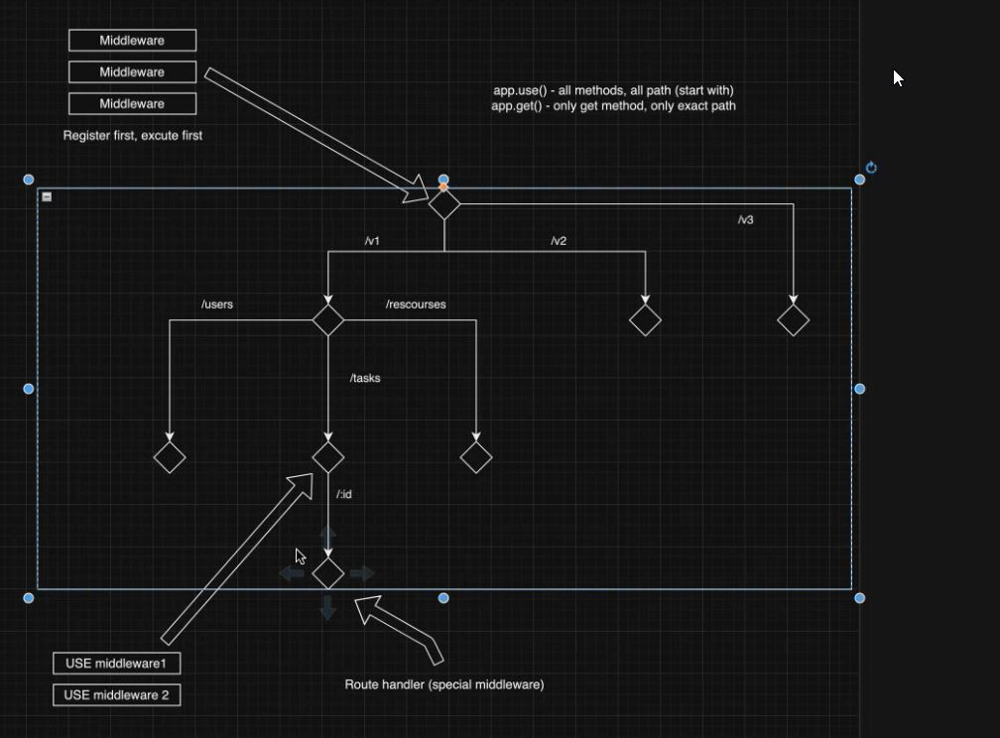
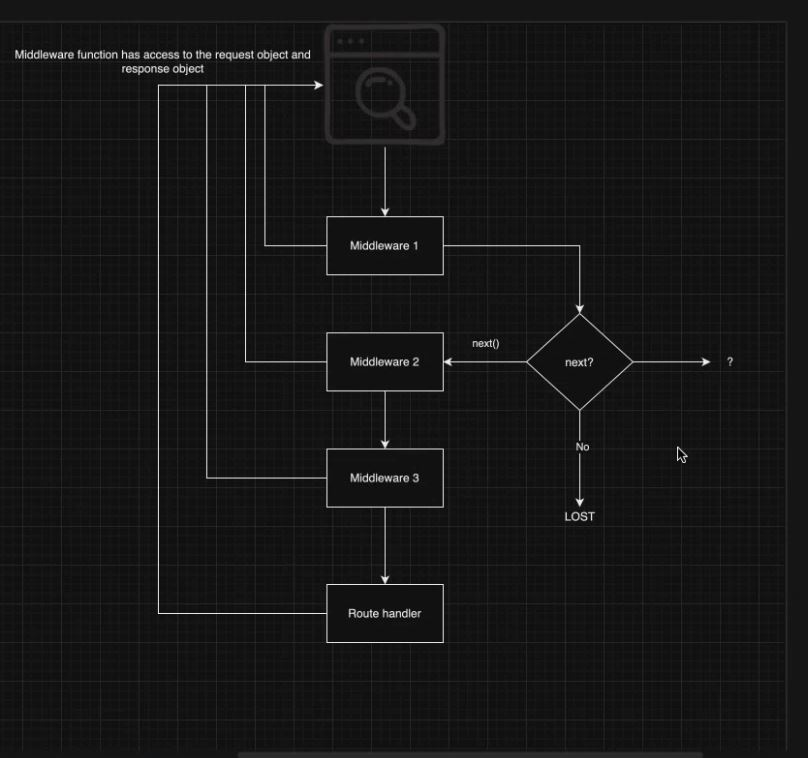
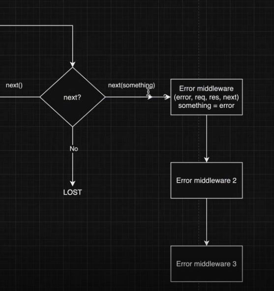

# Lecture 16 Node Part 3

本篇笔记是以 Mason 老师的 Lecture 16 Node.js (Part 3) 的课堂内容整理的随堂笔记。

## Table of Contents

1. [NPM - Node Package Manager](#1-npm---node-package-manager)
2. [Using NPM](#2-using-npm)
   - 2.1 [Initialization](#21-initialization)
   - 2.2 [Install Package](#22-install-package)
   - 2.3 [package.json and package-lock.json](#23-packagejson-and-package-lockjson)
   - 2.4 [node_modules](#24-node_modules)
   - 2.5 [Uninstall Package](#25-uninstall-package)
3. [Creating a server using server.js](#3-creating-a-server-using-serverjs)
4. [Dependencies](#4-dependencies)
   - 4.1 [Semantic Version](#41-semantic-version)
   - 4.2 [Installing Specific Versions of Packages](#42-installing-specific-versions-of-packages)
   - 4.3 [Vulnerabilities](#43-vulnerabilities)
   - 4.4 [Outdated](#44-outdated)
   - 4.5 [devDependencies](#45-devdependencies)
   - 4.6 [Global Dependencies](#46-global-dependencies)
   - 4.7 [npx](#47-npx)
   - 4.8 [scripts in package.json](#48-scripts-in-packagejson)
5. [Express.js](#5-expressjs)
   - 5.1 [Route methods](#51-route-methods)
   - 5.2 [app.use()](#52-appuse)
   - 5.3 [Get data from request](#53-get-data-from-request)
6. [Middleware](#6-middleware)

## 1. NPM - Node Package Manager

[`npm`](https://www.npmjs.com/) (Node package manager) is the world's largest software registry. Open source developers from every continent use `npm` to share and borrow packages, and many organizations use `npm` to manage private development as well.



- **DT**: TypeScript supported
- **4.19.2**: The latest version of this package
- **Public & Published**: Check to see if the package is actively maintained, although this should be used as a reference only.
- **Readme**: Treat it like documentation. Always read the README to understand if it has the necessary functionalities needed for your project and experiment with it in a sandbox before integrating it into your project.
- **Dependencies**: the other NPM packages that it relies on to function
- **Dependents**: packages that rely on this package. This information shows how many other packages use this package as a dependency.
- **Versions & Tags**: different versions of the package that have been published and the tags associated with those versions
  - **Versions**: the versions of the package that have been released. This section is crucial for tracking changes, bug fixes, and new features introduced over time.
  - **Tags**: Tags are aliases for specific versions of the package, making it easier to reference versions without needing to know the exact version number.

## 2. Using NPM

### 2.1 Initialization

- `npm init`

  OR

- `npm init -y` - automatically answers yes to all setup questions.

Creating a new `package.json` file for your Node.js project. This file is essential for managing your project's dependencies, scripts, version, and other metadata.

> 💡 This command will be only used when creating a new project.

### 2.2 Install package

- `npm install`

  OR

- `npm i`

### 2.3 package.json and package-lock.json

`package.json` and `package-lock.json` are two essential files that work together to manage dependencies and ensure consistency across different development environments

- `package.json`
  - It contains metadata about the project and its dependencies
- `package-lock.json`
  - Automatically generated when you run `npm install`
  - This file provides a detailed, versioned map of all dependencies (including nested dependencies) and their specific versions.
  - Ensures consistent installations across different environments by locking down the specific versions of each package.

### 2.4 node_modules

- It contains all the installed packages (dependencies) required by your project, as specified in your package.json and package-lock.json files
- It includes direct dependencies (listed in package.json) and their nested dependencies (dependencies of dependencies).

> 💡 node_modules is generated based on you current local environment

- So, it’s standard practice to add node_modules to your `.gitignore` file to avoid committing it to version control, as it can be regenerated from package.json and package-lock.json.

Example `.gitignore` entry:

```txt
node_modules/
```

### 2.5 uninstall package

```bash
npm uninstall [package_name]
```

## 3. Creating a server using server.js

Using `http` Module

```js
const http = require('http');

const server = http.createServer((req, res) => {
  if (req.url === '/') {
    res.write('hello world');
    res.end();
  }
});

server.listen(3000, () => {
  console.log('Server running on port 3000');
});
```

Using `express` Module (Recommended)

```js
const express = require('express');
const app = express();

app.use('/', (req, res) => {
  // route: '/' equals '' in express.js
  res.send('hello, world');
});

app.listen(3000, () => {
  console.log('Server running on port 3000');
});
```

> 💡 `express` simplifies the process of creating a server and handling HTTP requests and responses by encapsulating the core functionalities provided by the Node.js `http` module

## 4. dependencies

### 4.1 Sematic Version

```json
"dependancies": {
  "express": "^4.16.4"
}
```

Version numbers consist of three numbers separated by dots: `major.minor.patch`. Each of these numbers has a specific meaning:

- Major Version (`X.0.0`)
- Minor Version (`0.X.0`)
- Patch Version (`0.0.X`)

The `~` and `^` symbols are used in the version specification of dependencies in the `package.json` file to define version ranges.

- `^`: Installing the latest minor or patch version while keeping the same major version
- `~`: Installing the latest patch version while keeping the same minor version
- `package-lock.json` has eliminated the need for using `~` and `^` in version ranges within package.json.

> 💡 Always commit `package-lock.json` to version control to ensure deterministic builds and consistent dependencies across environments.

### 4.2 Installing Specific Versions of Packages

Used when:

- current(or latest) version have bugs
- need a update of current version

> 💡 Read the document of the specific version before using it.

Example:

```js
npm install express@3.0.0 // install version 3.0.0 of the express framework
```

### 4.3 vulnerabilities


To check and fix vulnerabilities in your project's dependencies.

```bash
npm audit fix
```

### 4.4 outdated

The `npm outdated` command is used to check for outdated dependencies in your Node.js project. It compares the versions of the installed dependencies in your `package.json` file with the latest versions available in the npm registry. This helps you identify which dependencies have newer versions available, allowing you to decide whether to update them.

```bash
npm outdated
```

### 4.5 devDependencies

`devDependencies` in the `package.json` file are dependencies that are only needed during development or for building the project. These dependencies are not required for the runtime execution of the project but are essential for tasks such as testing, linting, compiling, or building the project.

```bash
npm i --save-dev [package name]
npm i -D [package name] // The -D flag is a short form of --save-dev
```

### 4.6 Global Dependencies

```bash
npm i -g [package name]
```

> 💡 Install package globally is not recommended.

When you install packages globally (`npm install -g`), they are not added to the `package.json` file of your project. This is because global installations are not specific to any particular project; they are installed system-wide and are intended to be accessible from any directory on your system.

### 4.7 npx

`npx` is a package runner tool. It allows you to execute Node packages directly without having to install them globally or locally beforehand.

- `npx` is commonly used for running command-line tools or scripts from packages that you don't want to install globally or locally as project dependencies.
- It's especially useful for running one-off commands or tools that you only need temporarily.

### 4.8 scripts in package.json

The `scripts` section in the `package.json` file allows you to define custom scripts that can be executed using npm. These scripts can perform various tasks related to your project, such as running tests, building assets, starting servers, or performing other development or deployment tasks.

**Syntax**:

```bash
npm run {script name}
```

**Example**:

```json
// package.json
"scripts": {
  "dev": "nodemon index.js "
}
```

```bash
npm run dev
```

**Commonly Used Scripts**:

- `start`: Starts the application or server.
- `test`: Runs tests.
- `build`: Builds the project for production.
- `lint`: Lints code for style and errors.
- `deploy`: Deploys the project to a server or hosting environment.
- `precommit`: Runs tasks before committing changes (e.g., linting, formatting).

**shorthand commands**

```
npm start = npm run start
npm test = npm run test
npm stop = npm run stop
```

## 5. Express.js

`Express.js` is a fast, unopinionated, minimalist web framework for Node.js.

Other popular frameworks:

- Koa
- Fastify
- Loopback.js
- KeystoneJS
- Nest.js

The following code is an example of a very basic route.

```js
const express = require('express'); // import express
const app = express(); // create express instance

// app - application
// get - http method
app.get('/', (req, res) => {
  res.send('hello, world');
});

app.listen(3000);
```

> 💡 Recommend everyone memorize the above code template

### 5.1 Route methods

route methods are functions provided by the `express` object (typically assigned to `app`) to define routes for handling incoming HTTP requests. These methods correspond to HTTP verbs (GET, POST, PUT, DELETE, etc.) and are used to specify the action to be performed on a particular route.

1. **app.get(path, callback [, callback ...])**:

   - Defines a route that listens for GET requests on the specified path.
   - Used for fetching data or rendering views.

2. **app.post(path, callback [, callback ...])**:

   - Defines a route that listens for POST requests on the specified path.
   - Used for submitting data to the server to create or update resources.

3. **app.put(path, callback [, callback ...])**:

   - Defines a route that listens for PUT requests on the specified path.
   - Used for updating existing resources on the server.

4. **app.delete(path, callback [, callback ...])**:

   - Defines a route that listens for DELETE requests on the specified path.
   - Used for deleting resources on the server.

Examples:

```js
// GET method route
app.get('/', (req, res) => {
  res.send('GET request to the homepage');
});

// POST method route
app.post('/', (req, res) => {
  res.send('POST request to the homepage');
});

...
```

### 5.2 app.use()

In Express.js, `app.use()` is a method used to mount middleware functions at a specified path.

**Syntax**

```js
app.use([path,] callback [, callback...])
```

- **path** (optional): A string, a string pattern, a regular expression, or an array of any of these, that defines the base path for which the middleware function(s) should be executed. When no path is specified, the middleware will be applied to all requests.

  > 💡 When you specify a path with app.use(), the middleware function will be executed for any request that starts with that path, including any subpaths.

- **callback**: A middleware function or an array of middleware functions.

**Middleware Functions**

Middleware functions are functions that have access to the request object (req), the response object (res), and the next middleware function in the application’s request-response cycle. The next middleware function is commonly denoted by a variable named next.

### 5.5 Get data from request

In Express.js, you can get data from a request in several ways depending on where the data is coming from. The data could be in the query string, the URL parameters, the body of the request, or the headers.

1. URL Parameters

   ```js
   const express = require('express');
   const app = express();

   app.get('/users/:id', (req, res) => {
     const id = req.params.id;
     res.send(`User ID: ${id}`);
   });

   app.listen(3000, () => {
     console.log('Server is running on port 3000');
   });
   ```

2. Query Parameters

   ```js
   const express = require('express');
   const app = express();

   app.get('/search', (req, res) => {
     const term = req.query.term;
     res.send(`Search term: ${term}`);
   });

   app.listen(3000, () => {
     console.log('Server is running on port 3000');
   });
   ```

3. Request Body

   ```js
   const express = require('express');
   const app = express();

   // Middleware to parse JSON bodies
   app.use(express.json());

   app.post('/data', (req, res) => {
     const data = req.body;
     res.send(`Received JSON data: ${JSON.stringify(data)}`);
   });

   app.listen(3000, () => {
     console.log('Server is running on port 3000');
   });
   ```

## 6. Middleware

Express is a routing and middleware web framework that has minimal functionality of its own:An Express application is essentially a series of middleware function calls.

- It can excute any code
- It can make changes to the request and response objects
- It can end the request response cycle
- It can call the next middleware function in the stack，to invoke the next middleware function

  - if the current middleware function does not end the request-response cycle, it must call next() to pass control to the next middleware function. Otherwise, the request will be left hanging.

  

- Node.js backend is a series of middleware function calls
  
- error handling
  
- path not found
  - If next() is called, but the next middleware does not exist:
    - It defaults to the Express behavior of entering the "404 Page Not Found" route.
    - During development, it can be managed or left unhandled as desired.
