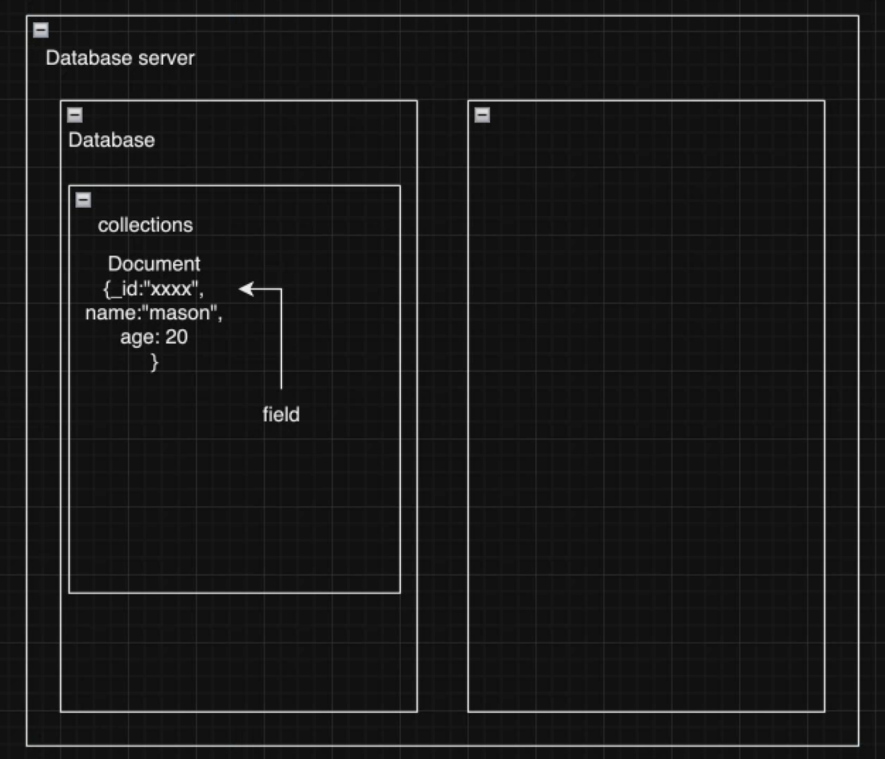

# Lecture 18 Node Part 5

本篇笔记是以 Mason 老师的 Lecture 18 Node.js (Part 5) 的课堂内容整理的随堂笔记。

参考：

- [MongoDB Doc](https://www.mongodb.com/docs/manual/core/document/)

## Table of Contents

1. [Types of Database](#1-types-of-database)
2. [Mongodb Introduction](#2-mongodb-introduction)
   - 2.1 [Primary Storage Units](#21-primary-storage-units)
   - 2.2 [Commmon Data Types in Documents](#22-common-data-types-in-documents)
3. [Mongosh](#3-mongosh)
4. [Operations](#4-operations)
   - 4.1 [Creating Documents](#41-creating-insert-documents)
   - 4.2 [Reading Documents](#42-reading-documents)
   - 4.3 [Updating Documents](#43-updating-documents)
   - 4.4 [Deleting Documents](#44-deleting-documents)
5. [Comparison Query Operators](#5-comparison-query-operators)
6. [Relation](#6-relation)
   - 6.1 [One to One](#61-one-to-one)
   - 6.2 [One to Many](#62-one-to-many)
   - 6.2 [Many to Many](#63-many-to-many)
7. [Best Practice](#7-best-practice-personal-advice)
8. [Recommend Reading](#8-recommend-reading)

## 1. Types of Database

**SQL Database**: Structured Query Language

- Designed for relational databases such as PostgreSQL, MySQL, SQLite.

**NoSQL Database**: Designed for non-relational databases

- Categories:
  - Document-oriented: e.g., MongoDB
  - Key-value: e.g., Redis
    - Commonly used as a caching database
  - Graph-oriented: e.g., Neo4j
  - Column-family: e.g., Cassandra
- Large-scale projects may utilize multiple databases, including both SQL and NoSQL databases tailored for different scenarios and data needs. In server architectures, each team may use its own microservices and databases, with various languages and frameworks.

## 2. MongoDB Introduction

MongoDB is a popular NoSQL database known for its flexibility, scalability, and ease of use. It stores data in JSON-like documents, which makes it easy to model and manipulate data.

**Features**:

- A No-SQL Database
- Store data in a JSON-like(BSON) documents (key-value pair)
- Flexibility or Schemaless
  - Unlike traditional relational databases, MongoDB allows for schema-less design. Documents in the same collection can have different fields, making it easy to evolve your data model.

### 2.1 Primary storage units



- **Database**:
  - A MongoDB deployment can have multiple databases, each serving a different purpose. Each database can contain multiple collections.
- **Collection**:
  - A group of MongoDB documents. It is equivalent to a table in a relational database.
- **Document**:
  - The basic unit of data. It is a record in a collection, analogous to a row in a relational database table, but more flexible due to its schema-less nature.

### 2.2 Common Data Types in Documents:

- **ObjectId**: A unique identifier for the document.
- **String**: Text data.
- **Number**: Integer or floating-point numbers (int32, int64, float).
- **Boolean**: true or false.
- **Date**: Date and time data (ISODate, timestamp).
- **Array**: A list of values.
- **Document**: A nested set of key-value pairs (sub-document).
- **Null**: A null value.
- **Binary Data**: Binary data.

## 3. Mongosh

`mongosh` is the MongoDB Shell, a JavaScript-based interactive interface for MongoDB. It allows you to interact with your MongoDB instances, perform administrative operations, and execute queries.

**Connecting to MongoDB with mongosh**

```bash
mongosh
```

## 4. Operations

**Show all Databases**

```bash
show databases
```

OR

```bash
show dbs
```

**Switch to a Database**

```bash
use [databaseName]
```

**Show all Collections of current database**

```bash
show collections
```

### 4.1 Creating (Insert) Documents

Inserting documents into a collection can be done using `insertOne` for a single document or `insertMany` for multiple documents.

**Insert a Single Document**

```js
db.[collectionName].insertOne({
  name: 'mason',
});
```

**Insert Multiple Documents**

```js
db.[collectionName].insertMany([{ name: 'mason' }, { name: 'James' }]);
```

### 4.2 Reading Documents

To read documents from a collection, you can use methods like `find` and `findOne`.

**Find all Documents**
To find all documents in `students` collections.

```bash
db.students.find()
```

**Find a Single Document**
To find a single document that matches a query, use the `findOne` method. Here is an example of how to find a document in the `students` collection where the name is "mason":

```bash
db.students.findOne({ name: "mason" });
```

**Find Multiple Documents**

To find multiple documents that match a query, use the find method. Here is an example of how to find all documents in the students collection where the age is greater than 20:

```bash
db.students.find({ age: { $gt: 20 } });
```

### 4.3 Updating Documents

```js
db.[collectionName].updateOne(
   <filter>,
   <update>,
   <options>
)

db.[collectionName].updateMany(
   <filter>,
   <update>,
   <options>
)
```

- `<filter>`: A query that matches the document to update.
- `<update>`: An update document that specifies the modifications.
- `<options>` (optional): Additional options for the update operation.

Updating a Single Document:

```bash
db.students.updateOne({ name: "mason" }, { $set: { name: "james" } });
```

Updating Multiple Documents:

```bash
db.students.updateMany({}, { $set: { dob:Date.now() } });
```

### 4.4 Deleting Documents

To delete documents from a collection, you can use methods like `deleteOne` and `deleteMany`.

**Delete a Single Document**

To delete a single document that matches a query, use the `deleteOne` method. Here is an example of how to delete a document from the `students` collection where the name is "mason":

```bash
db.students.deleteOne({ name: "mason" });
```

**Delete Multiple Documents**

To delete multiple documents that match a query, use the deleteMany method. Here is an example of how to delete all documents in the students collection where the age is less than 18:

```bash
db.students.deleteMany({ age: { $lt: 18 } });
```

**Delete All Documents**

```bash
db.students.deleteMany({});
```

## 5. Comparison Query Operators

MongoDB provides a variety of query operators to refine your search criteria.

- `$eq`: Matches values that are equal to a specified value.
- `$ne`: Matches all values that are not equal to a specified value.
- `$gt`: Matches values that are greater than a specified value.
- `$gte`: Matches values that are greater than or equal to a specified value.
- `$lt`: Matches values that are less than a specified value.
- `$lte`: Matches values that are less than or equal to a specified value.
- `$in`: Matches any of the values specified in an array.
- `$nin`: Matches none of the values specified in an array.

## 6. Relation

### 6.1 One to One

**Embedded**

- embed one document within another, forming a parent-child relationship.

```js
// Parent document (e.g., user)
{
"_id": ObjectId("..."),
"name": "John Doe",
"email": "john@example.com",
"address": {
    "city": "New York",
    "state": "NY",
    "country": "USA"
}
}
```

**Reference**

- store references to related documents using their ObjectId

```js
// Parent document (e.g., user)
    {
    "_id": ObjectId("..."),
    "name": "John Doe",
    "email": "john@example.com",
    "address_id": ObjectId("...") // Reference to the address document
    }

    // Address document
    {
    "_id": ObjectId("..."),
    "city": "New York",
    "state": "NY",
    "country": "USA"
    }

```

### 6.2 One to Many

**Embedded**

- embed multiple related documents within a single document

```js
// Parent document (e.g., post)
{
  "_id": ObjectId("..."),
  "title": "MongoDB One-to-Many Example",
  "content": "This is a sample post content.",
  "comments": [
    {
      "_id": ObjectId("..."),
      "author": "Alice",
      "text": "Nice post!"
    },
    {
      "_id": ObjectId("..."),
      "author": "Bob",
      "text": "Great job!"
    }
  ]
}
```

**Reference**

- store references to multiple related documents within a single document

```js
// Parent document (e.g., post)
{
  "_id": ObjectId("..."),
  "title": "MongoDB One-to-Many Example",
  "content": "This is a sample post content.",
  "comments": [
    ObjectId("..."), // Reference to comment 1
    ObjectId("...")  // Reference to comment 2
  ]
}

// Comment documents
// Comment 1
{
  "_id": ObjectId("..."),
  "author": "Alice",
  "text": "Nice post!"
},
// Comment 2
{
  "_id": ObjectId("..."),
  "author": "Bob",
  "text": "Great job!"
}

```

### 6.3 Many to Many

**Embedded (not recommended)**:

- Embedding documents for many-to-many relationships is generally not recommended
- The potential for large document sizes and difficulties in managing the data.

```js
// Example: Courses and Students

// Course document
{
  "_id": ObjectId("..."),
  "title": "Database Systems",
  "students": [
    {
      "_id": ObjectId("..."),
      "name": "Alice"
    },
    {
      "_id": ObjectId("..."),
      "name": "Bob"
    }
  ]
}

// Student document
{
  "_id": ObjectId("..."),
  "name": "Alice",
  "courses": [
    {
      "_id": ObjectId("..."),
      "title": "Database Systems"
    },
    {
      "_id": ObjectId("..."),
      "title": "Data Structures"
    }
  ]
}
```

**Reference**

- Storing references to related documents is the most common approach for many-to-many relationships.

```js
// Example: Courses and Students

// Course document
{
  "_id": ObjectId("..."),
  "title": "Database Systems",
  "student_ids": [
    ObjectId("..."), // Reference to student 1
    ObjectId("...")  // Reference to student 2
  ]
}

// Student document
{
  "_id": ObjectId("..."),
  "name": "Alice",
  "course_ids": [
    ObjectId("..."), // Reference to course 1
    ObjectId("...")  // Reference to course 2
  ]
}
```

**Intermediate Collection (Junction table)**

An intermediate collection (junction table) can be used to store the relationships between documents. This is a scalable and flexible approach.

```js
// Example: Courses and Students

// Course document
{
  "_id": ObjectId("..."),
  "title": "Database Systems"
}

// Student document
{
  "_id": ObjectId("..."),
  "name": "Alice"
}

// Enrollment document (junction table)
{
  "_id": ObjectId("..."),
  "course_id": ObjectId("..."), // Reference to course
  "student_id": ObjectId("...") // Reference to student
}

```

## 7. Best Practice (Personal Advice)

- Do embedded if you can (especially one to one),
  - but have to consider
    - will this relation will become one to many in the future
    - will this data need to be access independently
- One to couple(less than 10), consider array of embedded docs
- One to many, consider array of references
- One to million, consider parent-reference or child reference
- If read query is much more than write query, go denormalize

## 8. Recommend Reading

- [Index](https://www.mongodb.com/docs/manual/indexes/)

  - why use indexes?
  - how does index work?
  - why not use indexes everywhere?

- [Aggregation](https://www.mongodb.com/docs/manual/aggregation/)

- [Transactions](https://www.mongodb.com/docs/manual/core/transactions/)
