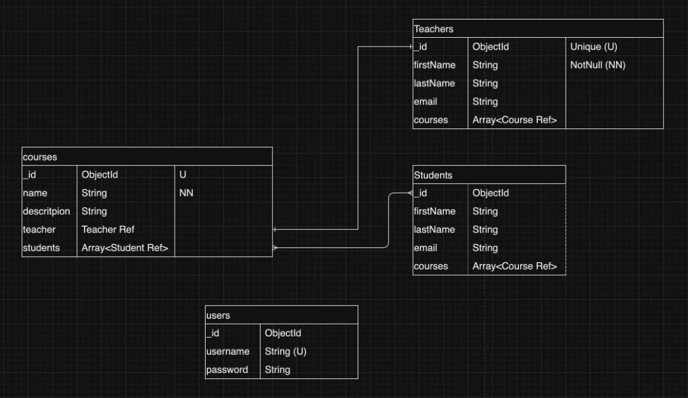

# Lecture 19 Node Part 6

本篇笔记是以 Mason 老师的 Lecture 19 Node.js (Part 6) 的课堂内容整理的随堂笔记。

课堂代码：

- [jr-cms](https://github.com/LazeBear/jr-fullstack-notes-22/tree/master/jr-cms)

## Table of Contents

1. [Mongoose](#1-mongoose)
2. [ERD](#2-erd)

## 1. Mongoose

Mongoose is an Object Data Modeling (ODM) library for MongoDB and Node.js. It provides a straightforward, schema-based solution to model your application data.

**Key Concepts**:

- **Schemas**

  A Schema in Mongoose is a blueprint for defining the structure of your MongoDB documents. It specifies the types of data, default values, validation rules, and more.

  ```js
  const mongoose = require('mongoose');

  const Schema = mongoose.Schema();
  const userSchema = new Schema({ name: String });
  ```

- **Models**

  A Model is a class created from a Mongoose schema. It represents a collection in the MongoDB database and provides an interface for interacting with the data. Models are used to create and read documents from the underlying MongoDB database.

  ```js
  const User = mongoose.model('User', userSchema);
  ```

- **Documents**

  A Document is an instance of a Model. It represents a single record in the database. Documents are objects that can be saved to and retrieved from the MongoDB database.

  ```js
  const newUser = new User({
    name: 'Mason',
  });

  newUser.save();
  ```

## 2. ERD

An Entity-Relationship Diagram (ERD) is a visual representation of the data and the relationships between entities within a database.

**Key Concepts**

- **Entities**:

  - Represent objects or concepts, typically nouns, that have a distinct existence in the database (e.g., `Customer`, `Order`, `Product`).

- **Attributes**:

  - Characteristics or properties of an entity (e.g., Customer might have attributes like CustomerID, Name, Email).

- **Relationships**:

  - Describe how entities interact with each other (e.g., Customer places an Order).

**Tools for ERM**:

- hackolade
- moon modeler
- lucid chart
- draw.io (free)

**Example**


