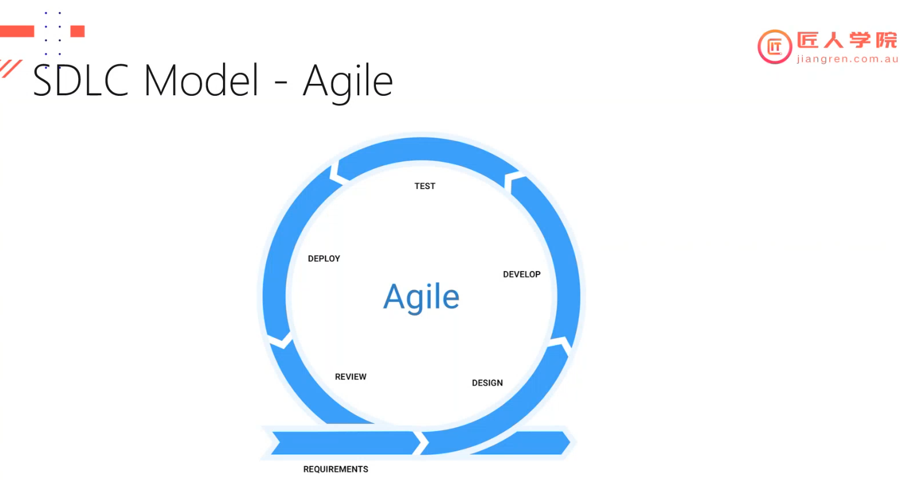
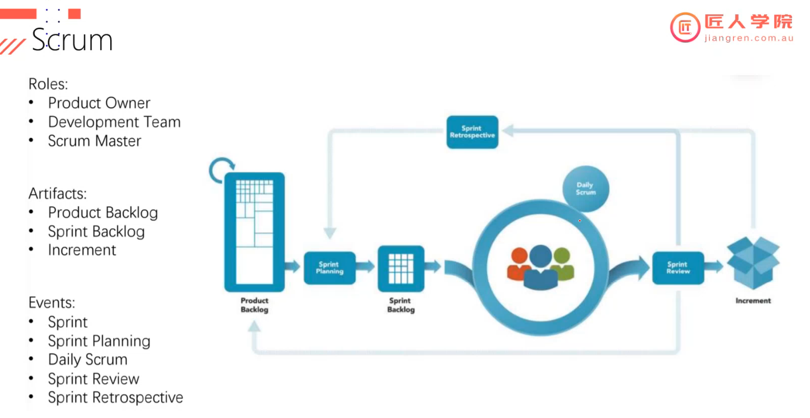
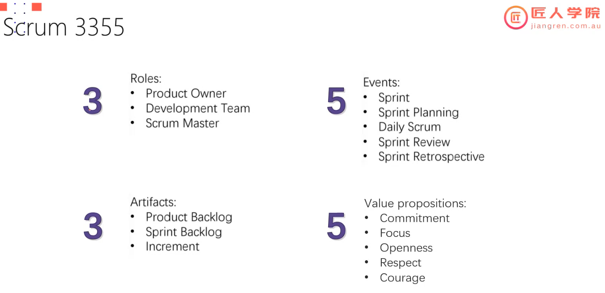
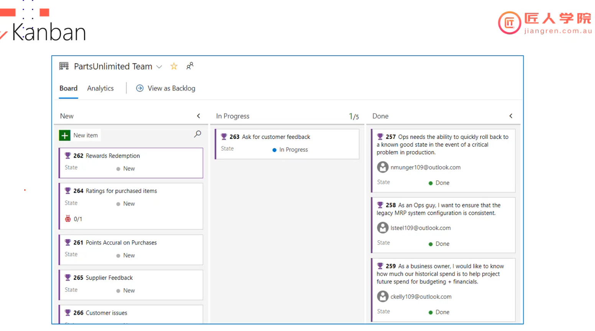

# Lecture 22 Agile & Scrum

本篇笔记是以 Ray 老师的 Lecture 22 Agile and Scrum 的课堂内容整理的随堂笔记。

## Table of Contents

1. [Agile](#1-agile)

   - [1.1 Software Development Life Cycle](#11-software-development-life-cycle)
   - [1.2 Agile Model](#12-agile-model)

2. [Scrum](#2-scrum)

   - [2.1 Roles](#21-roles)
   - [2.2 Artifacts](#22-artifacts)
   - [2.3 Events](#23-events)

3. [Kanban](#3-kanban)

## 1. Agile

Agile is a methodology for project management and software development that emphasizes flexibility, collaboration, and customer satisfaction.

### 1.1 Software Development Life Cycle

The Software Development Life Cycle (SDLC) is a structured process that outlines the stages involved in the development of software, from initial conception to deployment and maintenance. Each phase of the SDLC has specific deliverables and activities that ensure the development process is methodical and improves the likelihood of producing high-quality software.

**Model**

- Waterfall Model
  - A linear and sequential approach to software development. Each phase must be completed before the next phase begins
- V-Model
  - An extension of the Waterfall model that emphasizes validation and verification
- Agile
  - Agile is often chosen over traditional methodologies like the Waterfall model, due to its flexibility, responsiveness to change, and emphasis on collaboration and customer satisfaction

### 1.2 Agile Model

**Agile Values**

1. Individuals and Interactions over Processes and Tools

   - **Focus on People**: Agile values the skills, creativity, and collaboration of team members over the specific processes and tools they use. The belief is that talented and motivated individuals are the key to successful project outcomes.
   - **Effective Communication**: Direct communication and interactions are preferred over formal documentation and rigid processes. Face-to-face conversations and team collaboration are considered more effective for resolving issues and making decisions.

2. Working Software over Comprehensive Documentation

   - **Delivering Value**: The primary measure of progress in Agile is working software that delivers value to customers. While documentation is still important, it should not hinder the delivery of functional software.
   - **Minimal Viable Product (MVP)**: Agile encourages the development of a working product incrementally and iteratively, ensuring that useful features are delivered early and often.

3. Customer Collaboration over Contract Negotiation

   - **Active Engagement**: Agile promotes continuous collaboration with customers and stakeholders to ensure that the final product meets their needs and expectations. This ongoing dialogue helps to refine and adjust the project as necessary.
   - **Flexible Requirements**: Rather than adhering strictly to initial contract terms, Agile teams remain flexible and open to changes based on customer feedback and evolving requirements.

4. Responding to Change over Following a Plan

   - **Adaptability**: Agile recognizes that change is inevitable, especially in complex projects. Instead of resisting change, Agile methodologies embrace it and adapt accordingly to ensure the product remains relevant and valuable.
   - **Iterative Planning**: Agile teams plan in short cycles, allowing for adjustments and course corrections based on new information and feedback from each iteration.

**Agile Principles**

1. **Customer Satisfaction**: The highest priority is to satisfy the customer through early and continuous delivery of valuable software.

2. **Welcoming Change**: Agile processes harness change for the customer's competitive advantage.

3. **Frequent Delivery**: Deliver working software frequently, from a couple of weeks to a couple of months, with a preference for the shorter timescale.

4. **Collaboration**: Business people and developers must work together daily throughout the project.

5. **Support and Trust**: Build projects around motivated individuals. Give them the environment and support they need and trust them to get the job done.

6. **Face-to-Face Conversation**: The most efficient and effective method of conveying information is through face-to-face conversation.

7. **Working Software**: Working software is the primary measure of progress.

8. **Sustainable Development**: Agile processes promote sustainable development. The sponsors, developers, and users should be able to maintain a constant pace indefinitely.

9. **Technical Excellence**: Continuous attention to technical excellence and good design enhances agility.

10. **Simplicity**: The art of maximizing the amount of work not done is essential.

11. **Self-Organizing Teams**: The best architectures, requirements, and designs emerge from self-organizing teams.

12. **Reflection and Adjustment**: At regular intervals, the team reflects on how to become more effective, then tunes and adjusts its behavior accordingly.

## 2. Scrum

Scrum is an Agile framework used for managing complex software and product development. It provides a structured approach to iterative and incremental project management, emphasizing flexibility, collaboration, and continuous improvement. Scrum is widely used for its simplicity and effectiveness in delivering high-quality products.

**3355**

### 2.1 Roles:

1. **Product Owner**:

   - Represents the stakeholders and customers.
   - Responsible for maximizing the value of the product and managing the Product Backlog.
   - Prioritizes the backlog items based on business value and stakeholder input.

2. **Scrum Master**:

   - Facilitates the Scrum process and ensures the team adheres to Scrum principles and practices.
   - Removes impediments that hinder the team’s progress.
   - Serves as a coach to the team and organization on Scrum adoption.

3. **Development Team**:
   - A cross-functional group responsible for delivering the product increment.
   - Self-organizing and accountable for all aspects of the development process.
   - Typically consists of 3-9 members with diverse skill sets.

### 2.2 Artifacts:

1. **Product Backlog**:

   - An ordered list of all desired work on the project.
   - Continuously refined and prioritized by the Product Owner.

2. **Sprint Backlog**:

   - A set of Product Backlog items selected for the Sprint, plus a plan for delivering the product increment.
   - Managed by the Development Team.

3. **Increment**:
   - The sum of all completed Product Backlog items at the end of a Sprint.
   - Must be in a usable condition regardless of whether the Product Owner decides to release it.

### 2.3 Events:

1. **Sprint**:

   - A time-boxed period (usually 1-4 weeks) where a set of work is completed and made ready for review.
   - Sprints are of consistent duration throughout the development process.

2. **Sprint Planning**:

   - A meeting to define what can be delivered in the upcoming Sprint and how that work will be achieved.
   - Involves the entire Scrum team.

3. **Daily Scrum (Standup)**:

   - A 15-minute daily meeting for the Development Team to synchronize activities and create a plan for the next 24 hours.
   - Team members answer three questions: What did I do yesterday? What will I do today? Are there any impediments?

4. **Sprint Review**:

   - A meeting at the end of the Sprint to inspect the increment and adapt the Product Backlog if needed.
   - Stakeholders are invited to provide feedback on the increment.

5. **Sprint Retrospective**:
   - A meeting after the Sprint Review to reflect on the Sprint process and identify areas for improvement.
   - Focuses on team performance and process optimization.

## 3. Kanban

Kanban is a popular Agile methodology that focuses on visualizing work, limiting work in progress (WIP), and maximizing efficiency. Originating from lean manufacturing principles, Kanban has been adapted for knowledge work and software development to improve workflow management and productivity.

